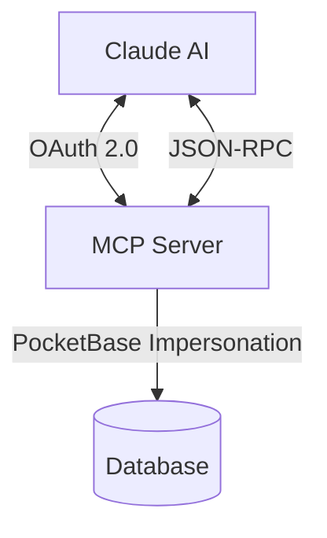

# Claude Integration

Family Todo nutzt das **Model Context Protocol (MCP)** für die Integration mit Claude. Diese Seite erklärt, wie die Verbindung funktioniert.

## Architektur



## OAuth 2.0 Flow

Die Authentifizierung läuft über einen standardkonformen OAuth 2.0 Flow:

1. **Client Registration**: Claude registriert sich als OAuth-Client beim MCP Server
2. **Authorization**: Der Benutzer wird zur Anmeldung weitergeleitet
3. **Token Exchange**: Nach erfolgreicher Anmeldung erhält Claude einen JWT Access Token
4. **API Access**: Alle MCP-Aufrufe werden mit dem Bearer Token authentifiziert

### Sicherheit

- **PKCE (S256)**: Schutz gegen Authorization Code Interception
- **JWT Access Tokens**: Stateless, signiert mit RS256
- **User Impersonation**: Der MCP Server agiert im Namen des Benutzers

## MCP Protocol

Das Model Context Protocol definiert, wie Claude mit externen Tools kommuniziert.

### Initialization

```json
{
  "jsonrpc": "2.0",
  "method": "initialize",
  "id": 1
}
```

Antwort:
```json
{
  "jsonrpc": "2.0",
  "result": {
    "protocolVersion": "2024-11-05",
    "serverInfo": {
      "name": "family-todo-mcp",
      "version": "1.0.0"
    },
    "capabilities": {
      "tools": {}
    }
  },
  "id": 1
}
```

### Verfügbare Tools

Claude kann folgende Tools aufrufen:

| Tool | Beschreibung |
|------|--------------|
| `list_groups` | Alle Familien des Benutzers anzeigen |
| `create_group` | Neue Familie erstellen |
| `delete_group` | Familie löschen |
| `list_children` | Kinder einer Familie anzeigen |
| `create_child` | Kind hinzufügen |
| `update_child` | Kind bearbeiten |
| `delete_child` | Kind entfernen |
| `list_tasks` | Aufgaben eines Kindes anzeigen |
| `create_task` | Aufgabe erstellen |
| `update_task` | Aufgabe bearbeiten |
| `delete_task` | Aufgabe löschen |
| `reset_task` | Erledigte Aufgabe zurücksetzen |

### Beispiel: Aufgabe erstellen

Request:
```json
{
  "jsonrpc": "2.0",
  "method": "tools/call",
  "params": {
    "name": "create_task",
    "arguments": {
      "childId": "abc123",
      "title": "Hausaufgaben machen",
      "priority": 1
    }
  },
  "id": 5
}
```

Response:
```json
{
  "jsonrpc": "2.0",
  "result": {
    "content": [{
      "type": "text",
      "text": "Created task \"Hausaufgaben machen\" (ID: xyz789)"
    }]
  },
  "id": 5
}
```

## Discovery Endpoints

Der MCP Server stellt standardkonforme Discovery-Endpoints bereit:

- `/.well-known/oauth-authorization-server` – OAuth Metadata
- `/.well-known/oauth-protected-resource` – Protected Resource Metadata
- `/.well-known/jwks.json` – Public Keys für JWT Verification

## Selbst hosten

Family Todo ist Open Source. Du kannst den MCP Server selbst hosten:

```bash
git clone https://github.com/levino/todo-app
cd todo-app
docker compose up -d
```

Konfiguriere dann die Umgebungsvariablen:

```env
OAUTH_ISSUER=https://your-domain.com
FRONTEND_URL=https://your-app.com
POCKETBASE_URL=http://pocketbase:8090
POCKETBASE_ADMIN_EMAIL=admin@example.com
POCKETBASE_ADMIN_PASSWORD=secure-password
```

## Weiterführende Links

- [MCP Specification](https://modelcontextprotocol.io/)
- [OAuth 2.0 RFC 6749](https://tools.ietf.org/html/rfc6749)
- [GitHub Repository](https://github.com/levino/todo-app)
