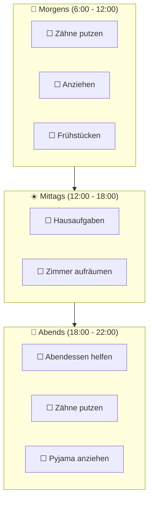

# Roadmap

Family Todo wird aktiv weiterentwickelt. Hier sind die geplanten Features.

## Phase 1: Wiederkehrende Aufgaben ⏳

**Status: In Planung**

Viele Aufgaben wiederholen sich täglich oder wöchentlich. Mit wiederkehrenden Aufgaben müssen diese nur einmal definiert werden.

### Geplante Features

- **Tägliche Aufgaben**: Automatisches Zurücksetzen um Mitternacht
- **Wöchentliche Aufgaben**: Bestimmte Tage auswählen (z.B. nur Schultage)
- **Automatische Erstellung**: Aufgaben erscheinen automatisch zur definierten Zeit

### Beispiel-Interaktion

> "Erstelle für Max eine tägliche Aufgabe 'Zähne putzen' die jeden Morgen erscheint"

> "Lisa soll jeden Montag und Mittwoch 'Klavier üben' als Aufgabe haben"

---

## Phase 2: Tageszeiträume 🌅

**Status: In Planung**

Aufgaben zu bestimmten Tageszeiten – Morgens, Mittags, Abends.

### Konzept

### Geplante Features

- **Drei Zeiträume**: Morgens, Mittags, Abends (konfigurierbar)
- **Visuelle Gruppierung**: Kiosk-Ansicht zeigt Aufgaben nach Tageszeit gruppiert
- **Automatische Filterung**: Nur relevante Aufgaben für die aktuelle Tageszeit

### Beispiel-Interaktion

> "Zeige mir nur die Morgen-Aufgaben von Max"

> "Füge 'Hausaufgaben' als Mittags-Aufgabe für Lisa hinzu"

---

## Phase 3: Belohnungssystem 🏆

**Status: Idee**

Motivation durch Punkte und Belohnungen.

### Ideen

- Punkte für erledigte Aufgaben
- Wöchentliche/monatliche Ziele
- Virtuelle oder reale Belohnungen
- Familien-Rangliste

---

## Phase 4: Benachrichtigungen 📱

**Status: Idee**

Push-Benachrichtigungen für Eltern.

### Ideen

- Tägliche Zusammenfassung
- Benachrichtigung wenn alle Aufgaben erledigt
- Erinnerungen für überfällige Aufgaben

---

## Phase 5: Multi-Familie 👨‍👩‍👧‍👦

**Status: Idee**

Unterstützung für komplexere Familiensituationen.

### Ideen

- Geteilte Kinder zwischen Haushalten
- Unterschiedliche Aufgaben je nach Haushalt
- Synchronisation zwischen Elternteilen

---

## Feedback

Hast du Ideen oder Wünsche?

- Öffne ein [GitHub Issue](https://github.com/levino/todo-app/issues)
- Oder frag Claude: *"Welche Features wünschst du dir für Family Todo?"* 😉

## Changelog

### v1.0.0 (Januar 2026)
- Erste öffentliche Version
- Grundlegende Aufgabenverwaltung
- Claude MCP Integration
- OAuth 2.0 Authentifizierung
