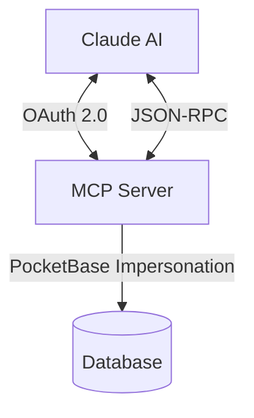

# Claude Integration

Family Todo uses the **Model Context Protocol (MCP)** for integration with Claude. This page explains how the connection works.

## Architecture



## OAuth 2.0 Flow

Authentication follows a standard OAuth 2.0 flow:

1. **Client Registration**: Claude registers as an OAuth client with the MCP server
2. **Authorization**: The user is redirected to login
3. **Token Exchange**: After successful login, Claude receives a JWT access token
4. **API Access**: All MCP calls are authenticated with the Bearer token

### Security

- **PKCE (S256)**: Protection against authorization code interception
- **JWT Access Tokens**: Stateless, signed with RS256
- **User Impersonation**: The MCP server acts on behalf of the user

## MCP Protocol

The Model Context Protocol defines how Claude communicates with external tools.

### Initialization

```json
{
  "jsonrpc": "2.0",
  "method": "initialize",
  "id": 1
}
```

Response:
```json
{
  "jsonrpc": "2.0",
  "result": {
    "protocolVersion": "2024-11-05",
    "serverInfo": {
      "name": "family-todo-mcp",
      "version": "1.0.0"
    },
    "capabilities": {
      "tools": {}
    }
  },
  "id": 1
}
```

### Available Tools

Claude can call the following tools:

| Tool | Description |
|------|-------------|
| `list_groups` | Show all families of the user |
| `create_group` | Create new family |
| `delete_group` | Delete family |
| `list_children` | Show children of a family |
| `create_child` | Add child |
| `update_child` | Edit child |
| `delete_child` | Remove child |
| `list_tasks` | Show tasks of a child |
| `create_task` | Create task |
| `update_task` | Edit task |
| `delete_task` | Delete task |
| `reset_task` | Reset completed task |

### Example: Create Task

Request:
```json
{
  "jsonrpc": "2.0",
  "method": "tools/call",
  "params": {
    "name": "create_task",
    "arguments": {
      "childId": "abc123",
      "title": "Do homework",
      "priority": 1
    }
  },
  "id": 5
}
```

Response:
```json
{
  "jsonrpc": "2.0",
  "result": {
    "content": [{
      "type": "text",
      "text": "Created task \"Do homework\" (ID: xyz789)"
    }]
  },
  "id": 5
}
```

## Discovery Endpoints

The MCP server provides standard-compliant discovery endpoints:

- `/.well-known/oauth-authorization-server` – OAuth Metadata
- `/.well-known/oauth-protected-resource` – Protected Resource Metadata
- `/.well-known/jwks.json` – Public Keys for JWT Verification

## Self-Hosting

Family Todo is open source. You can host the MCP server yourself:

```bash
git clone https://github.com/levino/todo-app
cd todo-app
docker compose up -d
```

Then configure the environment variables:

```env
OAUTH_ISSUER=https://your-domain.com
FRONTEND_URL=https://your-app.com
POCKETBASE_URL=http://pocketbase:8090
POCKETBASE_ADMIN_EMAIL=admin@example.com
POCKETBASE_ADMIN_PASSWORD=secure-password
```

## Further Reading

- [MCP Specification](https://modelcontextprotocol.io/)
- [OAuth 2.0 RFC 6749](https://tools.ietf.org/html/rfc6749)
- [GitHub Repository](https://github.com/levino/todo-app)
