# Family Todo: A New Kind of App

**Family Todo is a showcase for a radically new type of application – one that is administered exclusively via AI.**

## The Vision

Traditional apps have complex user interfaces with menus, forms, and countless settings. Users must learn how the app works, where each function is located, and how to manage their data.

**Family Todo takes a different approach.**

Instead of a classic admin interface, there's only a simple kiosk view for children and an AI interface for parents. Parents manage tasks, children, and families exclusively through natural language with Claude.

## The Concept

```mermaid
flowchart LR
    subgraph Children["👧 Children"]
        K1[View tasks]
        K2[Check off tasks]
    end

    subgraph Parents["👨‍👩‍👧‍👦 Parents"]
        E1[Create tasks]
        E2[Manage children]
        E3[Check progress]
    end

    Children -->|Kiosk View| App[(Family Todo)]
    Parents -->|Claude AI| App
```

## Why AI-First?

1. **Natural Interaction**: Instead of clicking through menus, parents simply describe what they want: *"Create a task 'Do homework' with high priority for Max"*

2. **No Learning Curve**: The app doesn't need to be "learned". Anyone who can talk to Claude can use the app.

3. **Flexibility**: Complex requests become possible: *"Show me all incomplete tasks from this week and create a report"*

4. **Future-Proof**: As AI improves, the app automatically gets better without UI changes.

## Case Study

Family Todo serves as a proof of concept for:

- **MCP (Model Context Protocol)**: Secure integration of AI into applications
- **OAuth 2.0 for AI**: Authentication of AI agents
- **AI-Native UX**: Design for AI-first applications

This documentation describes both the usage and technical details of the implementation.

## Next Steps

- [Getting Started](/docs/en/getting-started) – Set up the app and connect with Claude
- [Claude Integration](/docs/en/claude-integration) – How the AI connection works
- [Roadmap](/docs/en/roadmap) – Planned features
