# Family Todo: Eine neue Art von App

**Family Todo ist ein Showcase für eine radikal neue Art von Anwendung – eine, die ausschließlich mit KI administriert wird.**

## Die Vision

Traditionelle Apps haben komplexe Benutzeroberflächen mit Menüs, Formularen und unzähligen Einstellungen. Benutzer müssen lernen, wie die App funktioniert, wo welche Funktion zu finden ist und wie sie ihre Daten verwalten.

**Family Todo geht einen anderen Weg.**

Statt einer klassischen Admin-Oberfläche gibt es nur eine einfache Kiosk-Ansicht für die Kinder und eine KI-Schnittstelle für die Eltern. Eltern verwalten Aufgaben, Kinder und Familien ausschließlich durch natürliche Sprache mit Claude.

## Das Konzept

```mermaid
flowchart LR
    subgraph Kinder["👧 Kinder"]
        K1[Aufgaben sehen]
        K2[Aufgaben abhaken]
    end

    subgraph Eltern["👨‍👩‍👧‍👦 Eltern"]
        E1[Aufgaben erstellen]
        E2[Kinder verwalten]
        E3[Fortschritt prüfen]
    end

    Kinder -->|Kiosk-Ansicht| App[(Family Todo)]
    Eltern -->|Claude AI| App
```

## Warum AI-First?

1. **Natürliche Interaktion**: Statt sich durch Menüs zu klicken, beschreiben Eltern einfach, was sie wollen: *"Erstelle für Max die Aufgabe 'Hausaufgaben machen' mit hoher Priorität"*

2. **Keine Lernkurve**: Die App muss nicht "gelernt" werden. Wer mit Claude sprechen kann, kann die App bedienen.

3. **Flexibilität**: Komplexe Anfragen werden möglich: *"Zeige mir alle unerledigten Aufgaben von dieser Woche und erstelle einen Bericht"*

4. **Zukunftssicher**: Mit fortschreitender KI-Entwicklung wird die App automatisch besser, ohne UI-Änderungen.

## Case Study

Family Todo dient als Proof of Concept für:

- **MCP (Model Context Protocol)**: Sichere Integration von KI in Anwendungen
- **OAuth 2.0 für KI**: Authentifizierung von KI-Agenten
- **AI-Native UX**: Design für KI-first Anwendungen

Diese Dokumentation beschreibt sowohl die Benutzung als auch die technischen Details der Implementation.

## Nächste Schritte

- [Erste Schritte](/docs/de/getting-started) – App einrichten und mit Claude verbinden
- [Claude Integration](/docs/de/claude-integration) – Wie die KI-Anbindung funktioniert
- [Roadmap](/docs/de/roadmap) – Geplante Features
