# Roadmap

Family Todo is actively developed. Here are the planned features.

## Phase 1: Recurring Tasks ⏳

**Status: Planning**

Many tasks repeat daily or weekly. With recurring tasks, these only need to be defined once.

### Planned Features

- **Daily Tasks**: Automatic reset at midnight
- **Weekly Tasks**: Select specific days (e.g., school days only)
- **Automatic Creation**: Tasks appear automatically at the defined time

### Example Interaction

> "Create a daily task 'Brush teeth' for Max that appears every morning"

> "Lisa should have 'Practice piano' as a task every Monday and Wednesday"

---

## Phase 2: Time Periods 🌅

**Status: Planning**

Tasks for specific times of day – Morning, Noon, Evening.

### Concept

```mermaid
flowchart TB
    subgraph Morning["🌅 Morning (6:00 AM - 12:00 PM)"]
        M1["☐ Brush teeth"]
        M2["☐ Get dressed"]
        M3["☐ Have breakfast"]
    end

    subgraph Afternoon["☀️ Afternoon (12:00 PM - 6:00 PM)"]
        N1["☐ Do homework"]
        N2["☐ Clean room"]
    end

    subgraph Evening["🌙 Evening (6:00 PM - 10:00 PM)"]
        A1["☐ Help with dinner"]
        A2["☐ Brush teeth"]
        A3["☐ Put on pajamas"]
    end

    Morning --> Afternoon --> Evening
```

### Planned Features

- **Three Time Periods**: Morning, Afternoon, Evening (configurable)
- **Visual Grouping**: Kiosk view shows tasks grouped by time of day
- **Automatic Filtering**: Only relevant tasks for the current time period

### Example Interaction

> "Show me only Max's morning tasks"

> "Add 'Homework' as an afternoon task for Lisa"

---

## Phase 3: Reward System 🏆

**Status: Idea**

Motivation through points and rewards.

### Ideas

- Points for completed tasks
- Weekly/monthly goals
- Virtual or real rewards
- Family leaderboard

---

## Phase 4: Notifications 📱

**Status: Idea**

Push notifications for parents.

### Ideas

- Daily summary
- Notification when all tasks are completed
- Reminders for overdue tasks

---

## Phase 5: Multi-Family 👨‍👩‍👧‍👦

**Status: Idea**

Support for more complex family situations.

### Ideas

- Shared children between households
- Different tasks per household
- Synchronization between parents

---

## Feedback

Do you have ideas or requests?

- Open a [GitHub Issue](https://github.com/levino/todo-app/issues)
- Or ask Claude: *"What features would you like for Family Todo?"* 😉

## Changelog

### v1.0.0 (January 2026)
- First public release
- Basic task management
- Claude MCP integration
- OAuth 2.0 authentication
